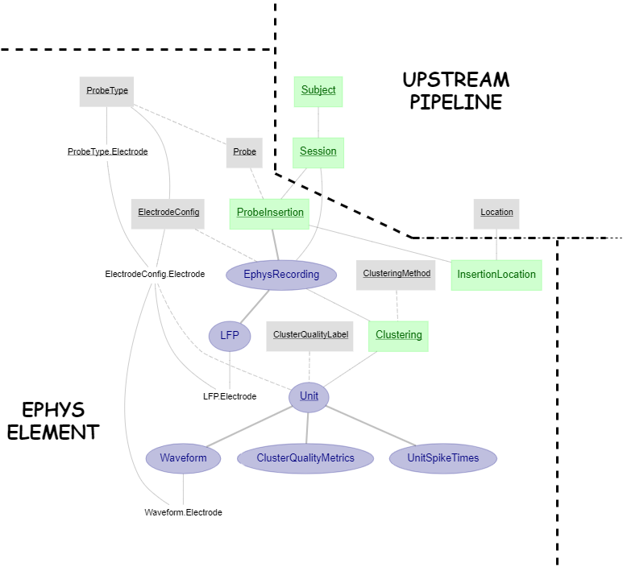

# DataJoint Element - Canonical Electrophysiology
DataJoint Element for electrophysiology.
This repository features DataJoint pipeline design for extracellular electrophysiology, 
with ***Neuropixels*** probe and ***kilosort*** spike sorting method. 

The pipeline presented here is not a complete pipeline by itself, but rather a modular 
design of tables and dependencies specific to the extracellular electrophysiology workflow. 

This modular pipeline element can be flexibly attached downstream 
to any particular design of experiment session, thus assembling a fully functional 
ephys pipeline.

## The Pipeline Architecture

As the diagram depicts, the ephys element starts immediately downstream from ***Session***, 
and also requires some notion of ***Location*** as a dependency for ***InsertionLocation***.

### The design of probe

+ ***ProbeType*** - a lookup table specifying the type of Neuropixels probe (e.g. "neuropixels 1.0", "neuropixels 2.0 single-shank")
+ ***ProbeType.Electrode*** - all electrode and their properties for a particular probe type
    + An electrode here refers to one recordable electrode site on the Neuropixels probe (e.g. for Neuropixels 1.0, there are 960 sites per shank)
+ ***Probe*** - record of an actual physical probe, identifiable by some unique ID (e.g. probe's serial number)
+ ***ElectrodeConfig*** - particular electrode configuration to be used for ephys recording
+ ***ElectrodeConfig.Electrode*** - corresponding electrodes in ***ProbeType.Electrode*** that are used for recording in this electrode configuration 
(e.g. for Neuropixels 1.0 or 2.0, there can be at most 384 electrodes usable for recording per probe)

### Extracellular ephys recording

+ ***ProbeInsertion*** - a surgical insertion of a probe onto the animal. 
Every experimental session consists of one or more ***ProbeInsertion***, with corresponding ***InsertionLocation***
+ ***EphysRecording*** - each ***ProbeInsertion*** is accompanied by a corresponding ***EphysRecording***, 
specifying the ***ElectrodeConfig*** used for the recording from the ***Probe*** defined in such ***ProbeInsertion***
    + ***get_npx_data_dir*** method - the class ***EphysRecording*** requires user 
    to supply a method to retrieve the directory containing the recorded neuropixels data (e.g. `*.ap.meta`, `*.ap.bin`, etc.), 
    where the method's input arguments are the primary attributes identifying one ***EphysRecording***
    
### Clusters and spikes

This ephys element features automatic ingestion for spike sorting results from the ***kilosort*** method. 

+ ***Clustering*** - specify instance(s) of clustering on an ***EphysRecording***, by some ***ClusteringMethod***
    + ***get_ks_data_dir*** method - the class ***Clustering*** requires user 
    to supply a method to retrieve the directory containing the kilosort results, 
    where the method's input arguments are the primary attributes identifying one ***Clustering***
+ ***Unit*** - Identified unit(s) from one ***Clustering***, with associated ***ClusterQualityLabel***
    + ***UnitSpikeTimes*** - spike times per unit
    + ***Waveform*** - mean waveform across spikes per unit per recording electrode

## Usage

See [this project](https://github.com/vathes/canonical-full-ephys-pipeline) for an example usage of this ephys pipeline element.
