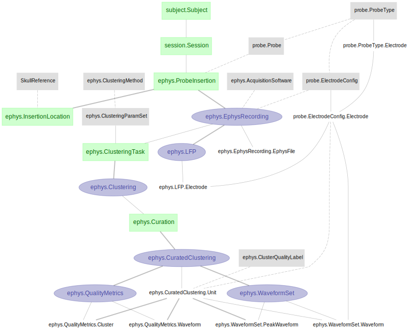
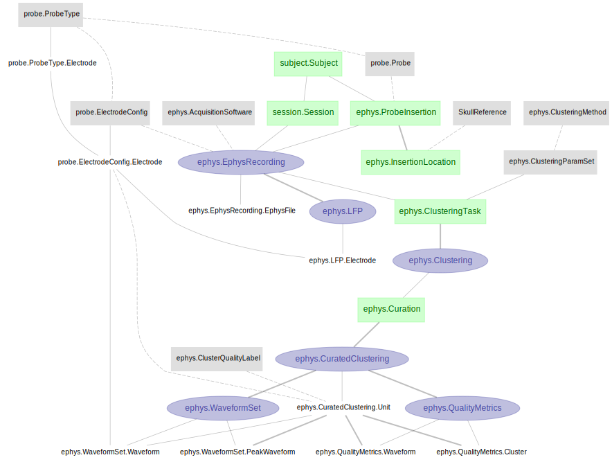

# DataJoint Element - Array Electrophysiology Element

+ This repository features DataJoint pipeline design for extracellular array electrophysiology, 
with Neuropixels probe and Kilosort spike sorting method. 

+ The pipeline presented here is not a complete pipeline by itself, but rather a modular 
design of tables and dependencies specific to the extracellular electrophysiology workflow. 

+ This modular pipeline element can be flexibly attached downstream 
to any particular design of experiment session, thus assembling a fully functional 
ephys pipeline.

+ See the [Element Array Electrophysiology documentation](https://elements.datajoint.org/description/array_ephys/) for the background information and development timeline.

+ For more information on the DataJoint Elements project, please visit https://elements.datajoint.org.  This work is supported by the National Institutes of Health.

## Element architecture

`element-array-ephys` is comprised of two schemas, `probe` and `ephys`.  To handle 
several use cases of this pipeline, we have designed several `ephys` schemas, including 
`ephys_acute`, `ephys_chronic`, and `ephys_precluster`.

+ `ephys_acute` - A probe(s) is inserted into a new location during each session.

+ `ephys_chronic` - A probe(s) is inserted once and used to record across multiple 
sessions.

+ `ephys_precluster` - A probe(s) is inserted into a new location during each session.  
And pre-clustering steps (e.g. CatGT) are performed on the data from each probe prior 
to Kilosort analysis.

### `ephys_acute` module



### `ephys_chronic` module


### `ephys_precluster` module


As the diagram depicts, the array ephys element starts immediately downstream from `Session`, 
and also requires some notion of `Location` as a dependency for `InsertionLocation`. We 
provide an [example workflow](https://github.com/datajoint/workflow-array-ephys/) with a 
[pipeline script](https://github.com/datajoint/workflow-array-ephys/blob/main/workflow_array_ephys/pipeline.py)
that models (a) combining this Element with the corresponding [Element-Session](https://github.com/datajoint/element-session)
, and (b) declaring a `SkullReference` table to provide Location.

## Table descriptions

### Probe & electrodes

The `probe` schema contains information regarding the Neuropixels probe and electrode configuration.

<details>
<summary>Click to expand details</summary>

+ `ProbeType` - a lookup table specifying the type of Neuropixels probe (e.g. "neuropixels 1.0", "neuropixels 2.0 single-shank")

+ `ProbeType.Electrode` - all electrode and their properties for a particular probe type
    + An electrode here refers to one recordable electrode site on the Neuropixels probe (e.g. for Neuropixels 1.0, there are 960 sites per shank)

+ `Probe` - record of an actual physical probe, identifiable by some unique ID (e.g. probe's serial number)

+ `ElectrodeConfig` - particular electrode configuration to be used for ephys recording

+ `ElectrodeConfig.Electrode` - corresponding electrodes in `ProbeType.Electrode` that are used for recording in this electrode configuration (e.g. for Neuropixels 1.0 or 2.0, there can be at most 384 electrodes usable for recording per probe)

</details>

### Extracellular electrophysiology recording

The `ephys` schema stores information regarding the recording from a probe for a given session.

<details>
<summary>Click to expand details</summary>

+ `ProbeInsertion` - a surgical insertion of a probe in the brain. Every experimental session consists of one or more entries in `ProbeInsertion` with a corresponding `InsertionLocation` each

+ `EphysRecording` - each `ProbeInsertion` is accompanied by a corresponding `EphysRecording`, specifying the `ElectrodeConfig` used for the recording from the `Probe` defined in such `ProbeInsertion`

</details>

### Clusters and spikes

The `ephys` schema features automatic ingestion of spike sorting results from the `Kilosort` analysis method. 

<details>
<summary>Click to expand details</summary>

+ `Clustering` - specify instance(s) of clustering on an `EphysRecording`, by some `ClusteringMethod`

+ `Curation` - specify instance(s) of curations performed on the output of a given `Clustering`

+ `CuratedClustering` - set of results from a particular round of clustering/curation
    + `CuratedClustering.Unit` - Identified unit(s) from one `Curation`, and the associated properties (e.g. cluster quality, spike times, spike depths, etc.)
    + `WaveformSet` - A set of spike waveforms for units from a given CuratedClustering

</details>

## Installation
<details>
<summary>Click to expand details</summary>

+ Install `element-array-ephys`
    ```
    pip install element-array-ephys
    ```

+ Upgrade `element-array-ephys` previously installed with `pip`
    ```
    pip install --upgrade element-array-ephys
    ```

+ Install `element-interface`
    + `element-interface` is a dependency of `element-array-ephys`, however it is not contained within `requirements.txt`.
    ```
    pip install "element-interface @ git+https://github.com/datajoint/element-interface"
    ```

</details>

## Usage

### Element activation

When using this Element, one needs to run `ephys.activate` to declare the schemas and tables on the database.

<details>
<summary>Click to expand details</summary>

To activate the `element-array-ephys`, ones need to provide:

1. Schema names
    + schema name for the probe module
    + schema name for the ephys module

2. Upstream tables
    + Session table: A set of keys identifying a recording session (see [Element-Session](https://github.com/datajoint/element-session)).
    + SkullReference table: A reference table for InsertionLocation, specifying the skull reference (see [example pipeline](https://github.com/datajoint/workflow-array-ephys/blob/main/workflow_array_ephys/pipeline.py)).

3. Utility functions. See [example definitions here](https://github.com/datajoint/workflow-array-ephys/blob/main/workflow_array_ephys/paths.py)
    + get_ephys_root_data_dir(): Returns your root data directory.
    + get_session_directory(): Returns the path of the session data relative to the root.

For more detail, check the docstring of the `element-array-ephys`:

    help(probe.activate)
    help(ephys.activate)

</details>

### Example usage

See [this project](https://github.com/datajoint/workflow-array-ephys) for an example usage of this Array Electrophysiology Element.

## Citation

+ If your work uses DataJoint and DataJoint Elements, please cite the respective Research Resource Identifiers (RRIDs) and manuscripts.

+ DataJoint for Python or MATLAB
    + Yatsenko D, Reimer J, Ecker AS, Walker EY, Sinz F, Berens P, Hoenselaar A, Cotton RJ, Siapas AS, Tolias AS. DataJoint: managing big scientific data using MATLAB or Python. bioRxiv. 2015 Jan 1:031658. doi: https://doi.org/10.1101/031658

    + DataJoint ([RRID:SCR_014543](https://scicrunch.org/resolver/SCR_014543)) - DataJoint for `<Select Python or MATLAB>` (version `<Enter version number>`)

+ DataJoint Elements
    + Yatsenko D, Nguyen T, Shen S, Gunalan K, Turner CA, Guzman R, Sasaki M, Sitonic D, Reimer J, Walker EY, Tolias AS. DataJoint Elements: Data Workflows for Neurophysiology. bioRxiv. 2021 Jan 1. doi: https://doi.org/10.1101/2021.03.30.437358

    + DataJoint Elements ([RRID:SCR_021894](https://scicrunch.org/resolver/SCR_021894)) - Element Array Electrophysiology (version `<Enter version number>`)